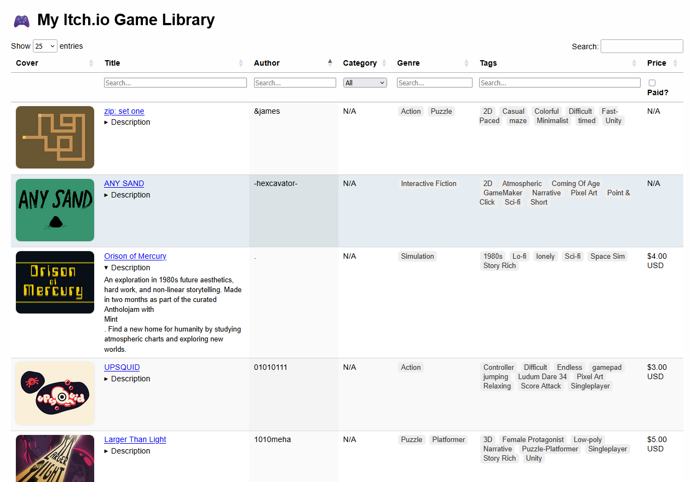
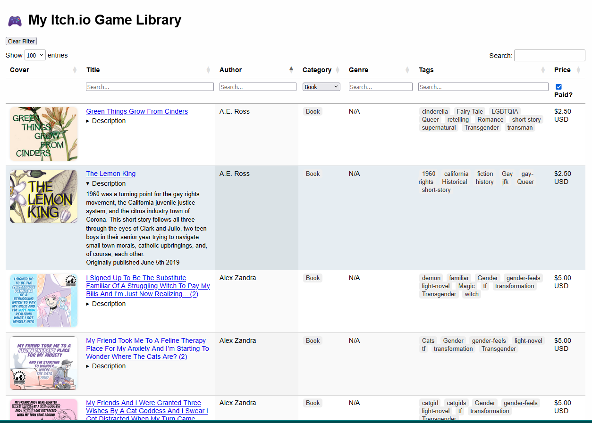
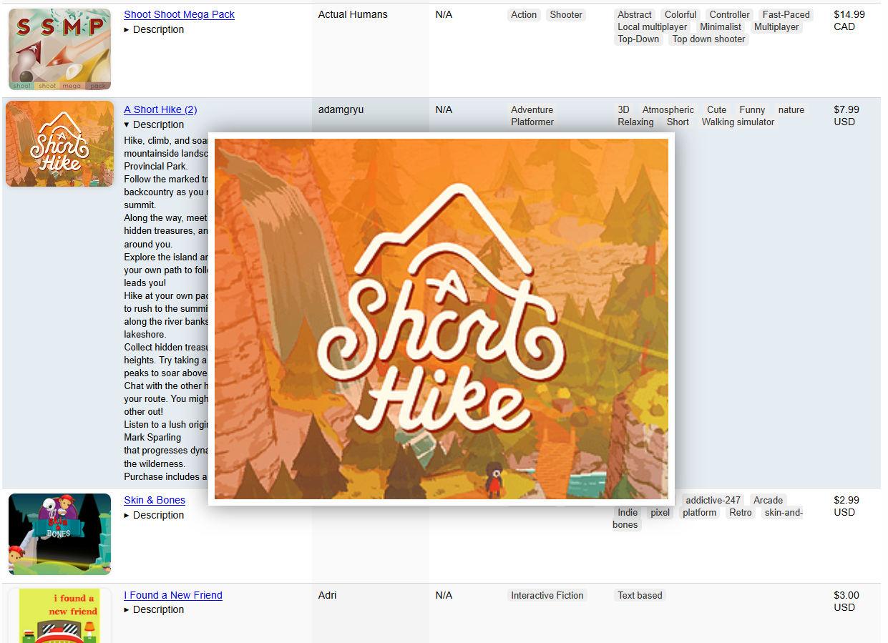

# Better-Itch.io-Library
A better way to browse, sort, and search your purchased and claimed games on Itch.io

Features:
* Fully Searchable and Sortable, with the option to filter by Category, Genre, and Tags simultaneously. 
* Collapsable Game descriptions and expanding Cover art
* Filter out free and Pay what you want games 
* Game titles link directly to the store page
* Number in parenthesis next to the title shows how many times you've claimed that game from bundles.

Instructions:
1. Load your Itch.Io library in a webpage (Not the Itch App), https://itch.io/my-purchases and scroll all the way to the bottom, making sure every single item is loaded.
2. Right Click on the Page and choose Save Page As, and save to a folder as My purchases - itch.io.htm (this should be the default name.)
3. Extract the desired folder to the same place you saved the library HTML.
3.5. Python only:install required dependencies
          pip install beautifulsoup4
          pip install selenium
          pip install requests
4. Run itch_scraper in the same folder at My purchases - itch.io.htm, depending on the size of your library this could take a while
5. After the CSV file is created, run csv_to_html_gallery, This will create and HTML page that can be loaded in a browser.

ToDo:
1. Make it so running the scraper again only adds new games to the file, reducing the amount of time it takes to update your library
2. Add a way to hide games so you only see the ones you want,
